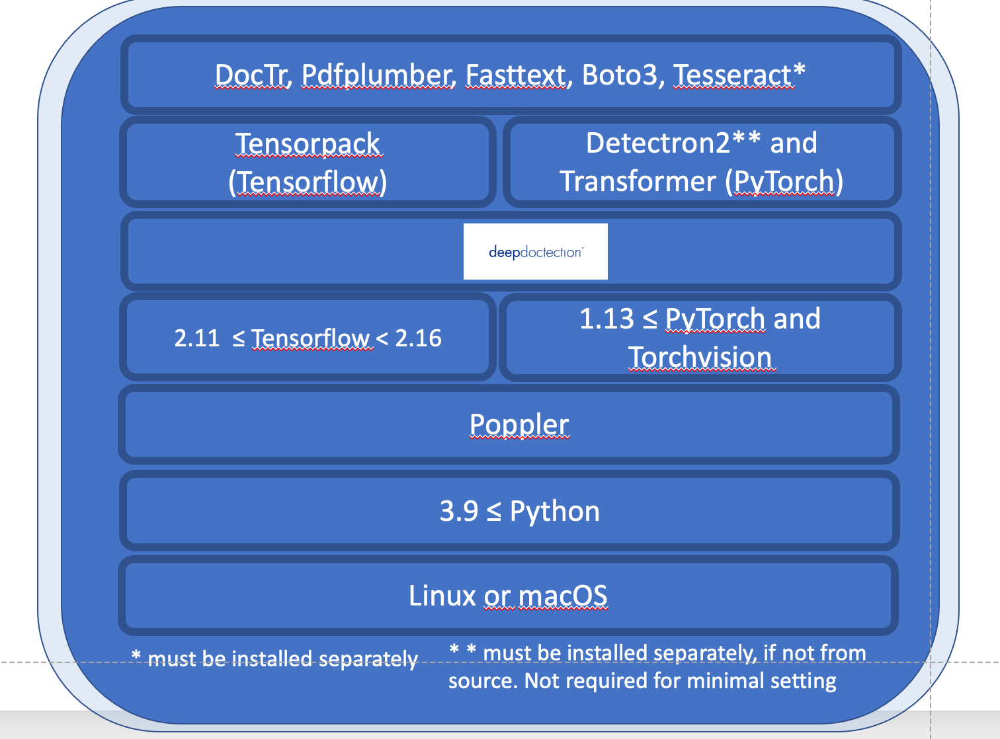

Title: I Like Big Tables 
Date: 2024-10-20 10:20
Category: Machine Learning
Slug: table-extraction
Authors: Rahul Gupta
Summary: I like tables. I use it in my notes, reports and software documentation related to cost/performance/estimation related information. Not just me, everyone like tables as well.

# Background

I like tables. I use it in my notes, reports and software documentation related to cost/performance/estimation related information. Not just me, everyone like tables as well.

- Companies use to present income statement, balance sheet in their SEC/SEBI filings.

- Banks mail their monthly statements as tables to their customers.

- Small and big businesses send their bills and invoice as tables

- Government bodies (nutrition, medical) publish their key findings as tables in public reports.

- Everyone’s paycheck and tax filings are formatted as tables.

# The business and key players

Here are some of the professional tools for table extraction in the market.

- Adobe Acrobat Pro: available for 20 USD a month.

- DocSumo.com : Raised 3.5 million USD. Focussed on enterprise customers. Available for 500 USD a month

- extracttable.com: Api based. Available for 0.04 page per USD.

- Nanonets: Raised 29 million USD. YC backed. Available for 0.3 per page.

Past approaches
1. Extracting Table with Native text: open-source python libtrary Tabula allows you do that. If you can select the text in a pdf with cursor, Tabula can extract that. This approach used pdf documents internal structure to extract the text entities and build table from that.

2. Classical ML approach: Train a supervised ML model on hand tuned features (like vertical and horizontal spaces between texts, visible lines etc). This model then can output table region/rectangle coordinates, cell boxes etc.

3. CNN-based approaches: Treat table pdf as an image and run CNN to output table table regions and cells and corresponding text and tables. You can further use this info to construct a table.

4. Transformer-based approach: in 2022, Microsoft released a table-transformer model along with the largest labelled dataset of pdf with tables PubTables-1M. This model achieved good accuracy and could handle various different types of document tables.

5. Graph Neural Network: Identify cells and corresponding text in it and define edges based on their spatial location. Thus a table pdf can be modelled as a graph, which can later be used to extract the table itself.

Most of the above mentioend companies use a mixture of Neural net(3,4,5) based approaches to process documets and let customer train their custom ML models.

An example stack for document AI stack

# Future
Although we have much better accuracy with transformer and GNN based models, There are few challenges

Cost of running the models is high, as these models need powerful GPU resources to run. (> 0.04 USD per page). Imagine a brokerage company who has to process ID cards for all its one million customers. Cost = 0.04 * 4 cards * 1 million = $ 160k

Privacy concerns: Sensitive financial and identity documents need to sent over to server with GPU hardware to process.

Most of the training dataset in pubTables-1M is in English. How well these models with generalise to documents(ID cards, passports) with multiple languages.

Complex stack: It would be nice to have a simplified stack for document AI. This will result in decreasing the cost as well.